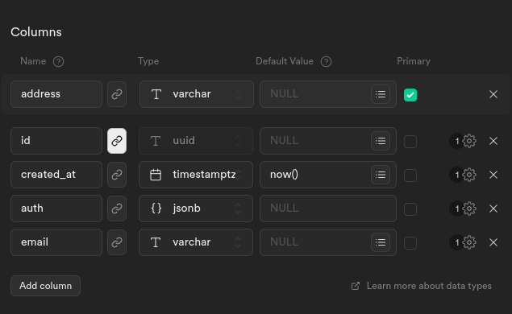
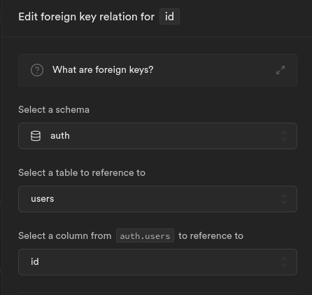
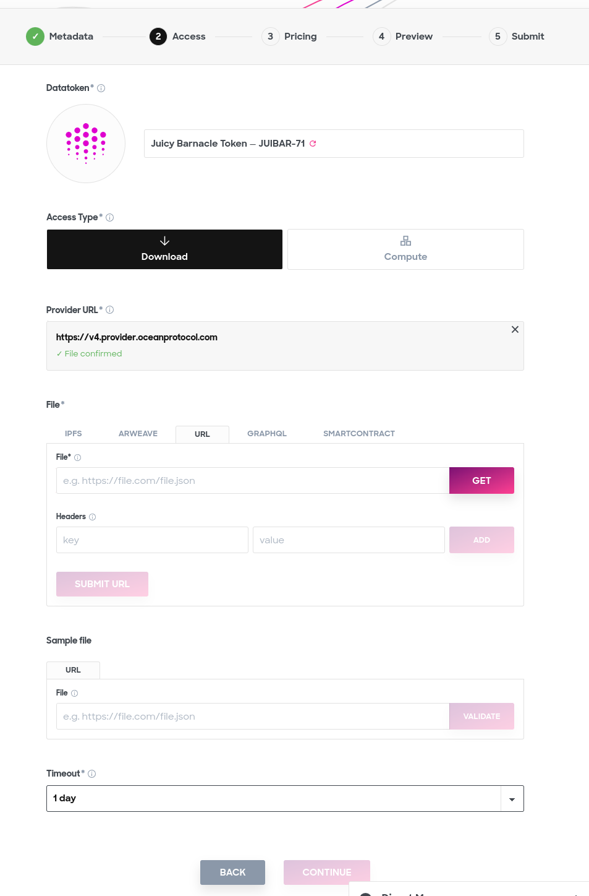
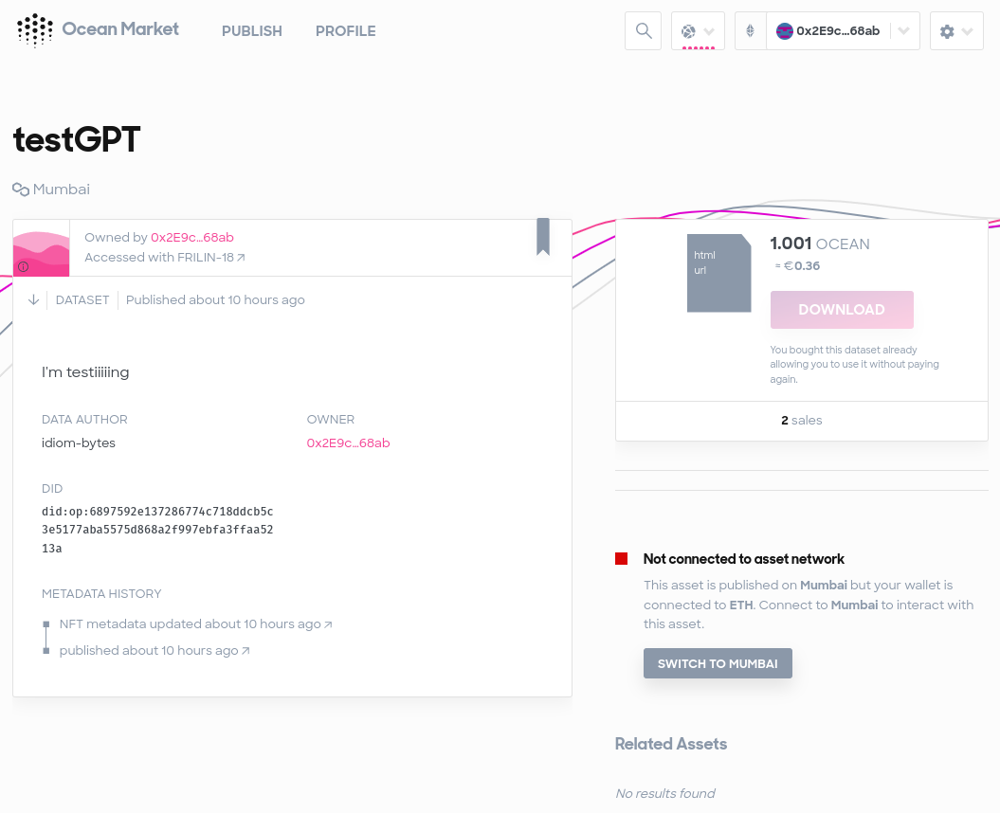

<a href="https://tokengated-next-chatgpt.vercel.app/">
  
  <h1 align="center">Ocean Protocol Tokengated Chatbot</h1>
</a>

<p align="center">
  A Web3 powered, Ocean Protocol tokengated, open-source AI chatbot app template built with Next.js, the Vercel AI SDK, OpenAI, and Supabase.
</p>

<p align="center">
  <a href="#features"><strong>Features</strong></a> ·
  <a href="#web3-powered"><strong>Web3 Powered</strong></a> ·
  <a href="#model-providers"><strong>Model Providers</strong></a> ·
  <a href="#security warning"><strong>Security Warning</strong></a> ·  
  <a href="#deploy-vercel-app"><strong>Deploy Vercel App</strong></a> ·
  <a href="#publish-datatoken"><strong>Publish Datatoken</strong></a> ·
  <a href="#running-locally"><strong>Running locally</strong></a> ·
  <a href="#authors"><strong>Authors</strong></a>
</p>
<br/>

## Features

- Obtain App access by purchasing a DataNFT from [Ocean Protocol](https://oceanprotocol.com/).
- Sign a Web3 transaction to identify yourself and login via a custom [Supabase Web3Auth](#supabase-web3auth).
- Prompt OpenAI (default), Anthropic, Hugging Face, or custom AI chat models and/or LangChain
- Chat History with [Supabase Postgres DB](https://supabase.com)
- [Next.js](https://nextjs.org) App Router
- React Server Components (RSCs), Suspense, and Server Actions
- [Vercel AI SDK](https://sdk.vercel.ai/docs) for streaming chat UI
- [shadcn/ui](https://ui.shadcn.com)
  - Styling with [Tailwind CSS](https://tailwindcss.com)
  - [Radix UI](https://radix-ui.com) for headless component primitives
  - Icons from [Phosphor Icons](https://phosphoricons.com)
- [Rainbowkit](https://www.rainbowkit.com/) and [Wagmi](https://wagmi.sh/) as wallet providers and React hooks
- [Ethers.js](https://docs.ethers.org/v5/) and [Infura](https://app.infura.io/) for the low-level work

## Web3 Powered

With a few clicks, you can deploy a Web3 enabled, tokengated, AI dApp that uses Ocean Protocol's DataNFT to prove ownership and access of the application.

What does this do?
1. Provides users with access by purchasing a DataNFT from the [Ocean Marketplace](https://market.oceanprotocol.com/).
2. Allows users to login and authorize with an off-chain Web3 signature.

## Model Providers

This template ships with OpenAI `gpt-3.5-turbo` as the default. However, thanks to the [Vercel AI SDK](https://sdk.vercel.ai/docs), you can switch LLM providers to [Anthropic](https://anthropic.com), [Hugging Face](https://huggingface.co), or using [LangChain](https://js.langchain.com) with just a few lines of code.

## Security Warning

For the Web3 implementation to work, we need to implement **Supabase's service_key** in the app. You can learn more about this by reading the [Supabase Web3Auth](#supabase-web3auth) for more intuition.

If you are not careful with this as a developer you can easily expose your Supabase's admin role to the user. Please be careful to not expose getServiceSupabase() or NEXT_PUBLIC_SUPABASE_SERVICE_KEY.

What does this mean? 

**[Never use a service key on the client](https://supabase.com/docs/guides/auth/row-level-security#never-use-a-service-key-on-the-client)**

## Deploy Vercel App

Before hopping into code, let's launch the app and play with it.
1. Fork this repository: [tokengated-next-chatgpt](https://github.com/oceanprotocol/tokengated-next-chatgpt/) via Github.
1. Get a new [OpenAI API key](https://platform.openai.com/apps)
1. Deploy a new [DB in Supabase](https://supabase.com/dashboard/sign-in)
1. Setup your `public.users` table inside Supabase. We have provided you a screenshot of what ours looks like so you can configure it in the exact same way. <figure></figure> Please note that your `public.users.id` should link to your `auth.users.id` record <figure></figure>
1. Setup your Supabase Role Level Security (RLS) by executing the [scripts located below](#configure-supabase) inside the Supabase SQL Editor.
1. Get an [infura API key](https://www.infura.io/)
1. Hop onto Vercel and [Deploy your forked repository](https://vercel.com/new/) as a new Vercel project and configure your environment variables.
1. Configure your Vercel->project->settings to rebuild `sdk.ts` by overriding the build command with: `yarn generate && yarn build`
1. You should now have all the initial ENV_VARS required to deploy the initial version of the app.
1. Finally, after Vercel is deployed, update your Supabase's Project: [Authentication / URL Configuration / Site URL](https://supabase.com/dashboard/project/) to be your Vercel's app URL.

```
OPENAI_API_KEY=your-open-ai-key
NEXT_PUBLIC_SUPABASE_URL=your-supabase-project-url
NEXT_PUBLIC_SUPABASE_ANON_KEY=your-supabase-anon-key
NEXT_PUBLIC_SUPABASE_SERVICE_KEY=your-supabase-service-key
NEXT_PUBLIC_SUPABASE_JWT_SECRET=your-supabase-jwt-key
NEXT_PUBLIC_WC2_PROJECT_ID=your-wallet-connect-project-id
NEXT_PUBLIC_INFURA_API_KEY=your-infura-api-key
NEXT_PUBLIC_WEB3AUTH_MESSAGE=Please sign this message to confirm your identity. Nonce:
NEXT_PUBLIC_APP_DOMAN=@yourdomain.com
```
_Initial Environment Variables required for Vercel app to work_

## Configure Supabase
In the SQL Editor, we're going to create the remainder of the role-level security policies we'll need to keep the DB secure.

You should already have a `public.users` table from the work you did in [Deploy Vercel App](#deploy-vercel-app)

```
-- Create view of auth.users and set strict access.
create view public.auth_users as select * from auth.users;
revoke all on public.auth_users from anon, authenticated;

-- service-role policy
CREATE POLICY service_role_access ON public.users
AS PERMISSIVE FOR ALL
TO service_role
USING (auth.role() = 'service_role')
WITH CHECK (auth.role() = 'service_role');

-- authenticated user policy
CREATE POLICY authenticated_users_can_write ON public.users
AS PERMISSIVE FOR UPDATE
TO authenticated
USING (auth.role() = 'authenticated')
WITH CHECK (auth.role() = 'authenticated');

-- web3 auth policy
CREATE POLICY web3_auth ON public.users
AS PERMISSIVE FOR UPDATE
TO authenticated
USING ((current_setting('request.jwt.claims', true))::json ->> 'address' = address)
WITH CHECK ((current_setting('request.jwt.claims', true))::json ->> 'address' = address);
```

## Publish Datatoken

We recommend using the [Alchemy Mumbai Testnet](https://www.alchemy.com/overviews/mumbai-testnet) to deploy your datatoken. It will be fast and free.  
```
Network Name: Mumbai Testnet
New RPC URL: https://polygon-mumbai.g.alchemy.com/v2/your-api-key
Chain ID: 80001
Currency Symbol: MATIC
Block Explorer URL: https://mumbai.polygonscan.com/
```
_The Mumbai network_  

1. Let's begin by adding the Mumbai network to your wallet. 
1. Now connect your wallet to the Mumbai network. <figure></figure>
1. Now get your wallet `0x address` for later.
1. We need some tokens to make transactions, [collect MATIC from this faucet](https://mumbaifaucet.com/) so we can create the Data token.
1. Make sure to also [collect OCEAN from this faucet](https://faucet.mumbai.oceanprotocol.com/) so you can also buy some tokens.
1. Deploy a Datatoken (DT) inside the [OCEAN marketplace](https://market.oceanprotocol.com/). On Step-2, select File-type "URL" and use the Vercel url as the address so you can complete the wizard (this architecture doesn't use it). You can now see your datatoken, copy the `0x address`. <figure></figure>
1. You have now published a Datatoken. When a user purchases this, they will gain access to our application. So, let's make sure to buy one so we can obtain access to the app after we deploy it.
<figure></figure>

### Complete Vercel Configuration

You can now complete configuring the Vercel app.

Go back to your Vercel->project->settings->Environment Variables and add the rest of them.
```
NEXT_PUBLIC_WEB3AUTH_TTL = 3600
NEXT_PUBLIC_DATATOKEN_ADDRESS = 0x2eaa179769d1Db4678Ce5FCD93E29F81aD0C5146
NEXT_PUBLIC_SUBGRAPH_URL = "https://v4.subgraph.mumbai.oceanprotocol.com/subgraphs/name/oceanprotocol/ocean-subgraph"
```
_Ocean Protocol and Datatoken Environment Variables_

User subscriptions are verified at login based on when the Datatoken was purchased + TTL. Users are only authorized to prompt until the subscription expires.

## Running locally

**Before you start,** make sure you have followed every step from [Deploy Vercel App](#deploy-vercel-app) so your application can be configured correctly.

You will need to use the environment variables [defined in `.env.example`](.env.example) to run OP's Tokengated AI Chatbot.

Copy the `.env.example` file and populate the required env vars:

```bash
cp .env.example .env
```

[Install the Supabase CLI](https://supabase.com/docs/guides/cli) and start the local Supabase stack:

```bash
npm install supabase --save-dev
npx supabase start
```

Install the local dependencies and start dev mode:

```bash
pnpm install
pnpm dev
```

Your app template should now be running on [localhost:3000](http://localhost:3000/).

### Building GQL SDK

Vercel currently does not support `graphql-generate` as part of the build, so you'll have to do this ahead of time.

As you write more GQL, please run the `yarn generate` command to update your local GQL library and SDK. This will help you maintain good code and avoid type safety issues.

You can then add the newly built SDK before deploying a new Vercel Build.
```
yarn generate
git add .
git commit -m "updating gql"
git push
```

## Authors

This scaffolding is an extension of the fantastic [Vercel AI-Chatbot](https://github.com/supabase-community/vercel-ai-chatbot) project.

Ocean Protocol ([@oceanprotocol](https://twitter.com/oceanprotocol)) has provided the work to build a custom Web3 Auth on top of Supabase, token-gated access with a DataNFT, and to provide a Web3 scaffolding to create AI dApps.

Special thanks to [@kdetry](https://github.com/kdetry) and [@idiom-bytes](https://github.com/idiom-bytes) for assembling this.

No sealife was harmed in the making of this repository.
